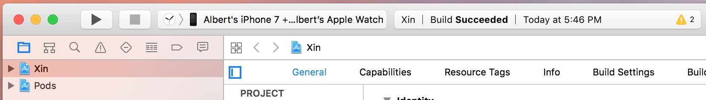
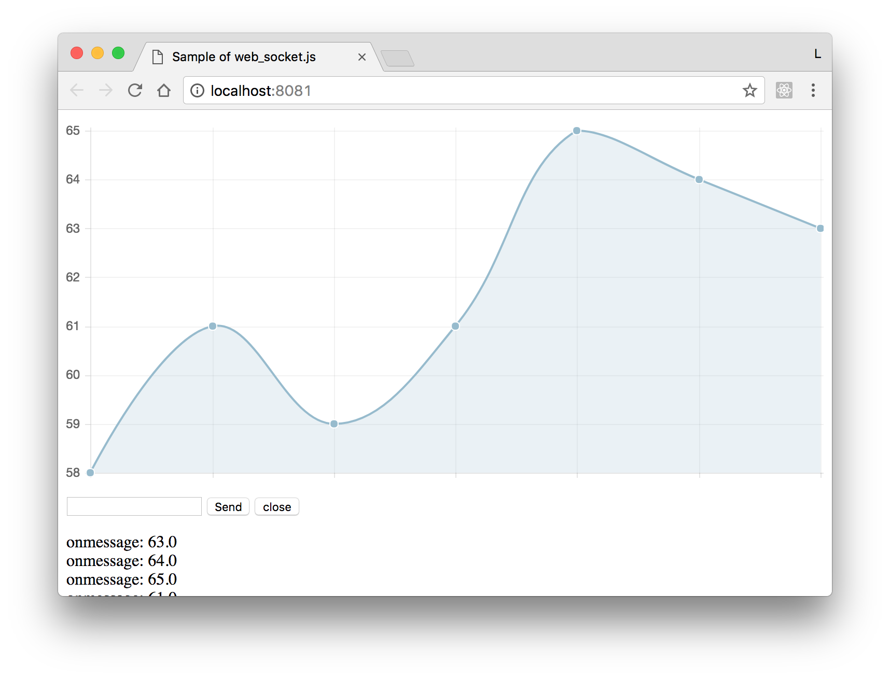

# Xin

Use apple watch read user heat rate and monitor heart rate data from web.

## setup server

Go to `server` directory, run:

  	$ npm install

or

  	& yarn

Start server:

```
  $ npm start
  > socket@1.0.0 start /Users/Albert/Desktop/Xin/server
  > node server.js

  server is: 192.168.36.58:8080
  waitting for source client connect
```

## setup app

Go to `app` directory, run:

 	 $ pod install

Open `Xin.xcworkspace` with Xcode.

Connect your iPhone to mac.

Select your apple watch device from Xcode.



Run `Xin` watch app on your apple watch.

After app lautched on watch, hit `Start` button.

Lautch `Xin` app from you iPhone.

Input server address, hit connect.

## connct

Watch terminal witch server started, it will print the web address, open it with browser.

```
new connection
open browser at : http://localhost:8081
```

